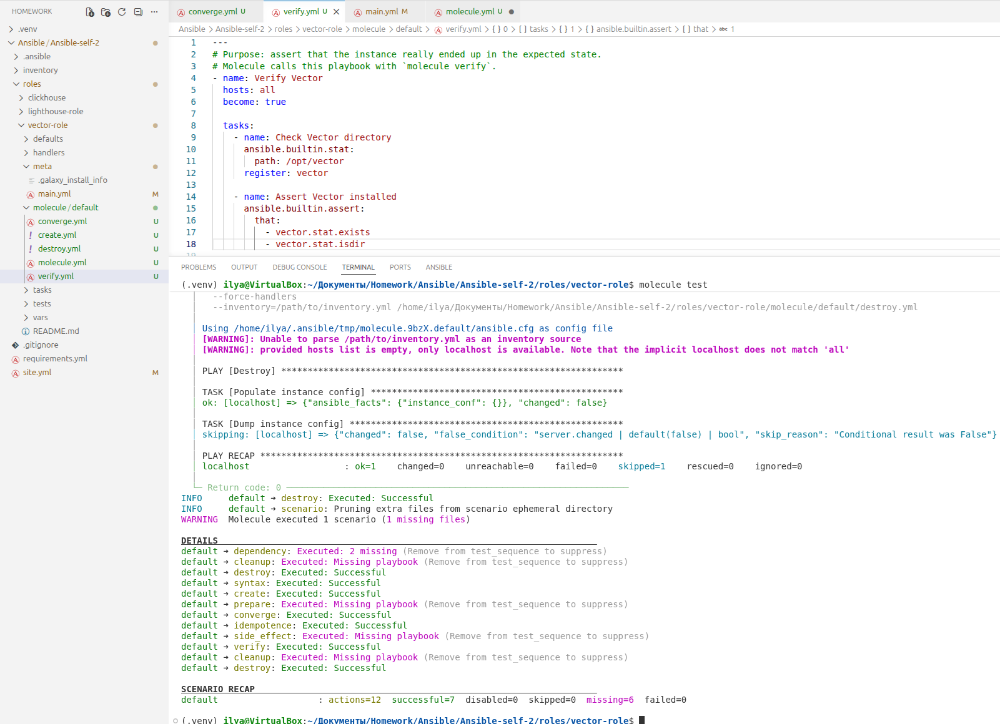
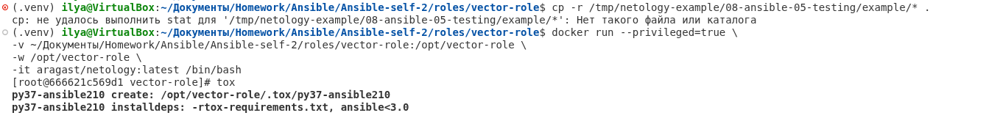
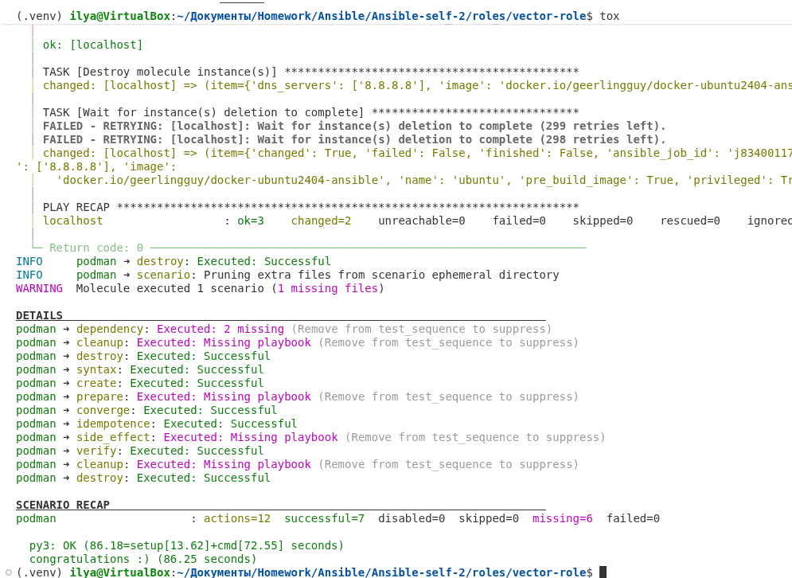

# Ansible Vector Role --- Molecule and Tox Testing

## Репозиторий

[vector-role](https://github.com/deminilyadev-maker/vector-role)

В рамках задания выполнено тестирование роли `vector-role` с
использованием Molecule и Tox.

Итоговый репозиторий содержит два сценария Molecule:

-   `molecule/default` --- основной сценарий;
-   `molecule/podman` --- облегчённый сценарий с драйвером Podman.

Также добавлены `tox.ini` и `tox-requirements.txt`.

------------------------------------------------------------------------

# Molecule

## 1. Создание сценариев

Для роли `vector-role` подготовлены два Molecule-сценария:

``` text
molecule/
├── default/
│   ├── molecule.yml
│   ├── converge.yml
│   └── verify.yml
└── podman/
    ├── molecule.yml
    ├── converge.yml
    └── verify.yml
```

Основной сценарий используется для стандартного тестирования роли.

Облегчённый сценарий `podman` создан для выполнения задания с драйвером
Podman.

## 2. Podman-сценарий

Для сценария `podman` используется:

``` yaml
driver:
  name: podman
```

В качестве тестовой платформы используется Ubuntu:

``` yaml
image: docker.io/geerlingguy/docker-ubuntu2404-ansible
```

Контейнер запускается с:

``` yaml
privileged: true
```

Запуск сценария:

``` bash
molecule test -s podman
```

Результат выполнения сценария:


## 3. Проверка Vector

В `verify.yml` выполняется проверка каталога установки Vector:

``` yaml
- name: Check Vector directory
  ansible.builtin.stat:
    path: /opt/vector
  register: vector

- name: Assert Vector installed
  ansible.builtin.assert:
    that:
      - vector.stat.exists
      - vector.stat.isdir
```

Результат проверки:



------------------------------------------------------------------------

# Tox

## 1. Настройка tox.ini

Для автоматического запуска облегчённого сценария добавлен `tox.ini`.

Основная команда:

``` ini
commands =
    {posargs:molecule test -s podman --destroy always}
```

Для совместимости с используемой версией Ansible и `molecule-podman`
настроена переменная:

``` ini
setenv =
    ANSIBLE_ALLOW_BROKEN_CONDITIONALS = True
```

## 2. Запуск Tox

После настройки `tox.ini` тесты запускаются командой:

``` bash
tox
```

Tox запускает:

``` bash
molecule test -s podman --destroy always
```

Результат запуска Tox:



Итоговый результат:



------------------------------------------------------------------------

# Структура репозитория

``` text
vector-role/
├── defaults/
├── handlers/
├── meta/
├── molecule/
│   ├── default/
│   │   ├── molecule.yml
│   │   ├── converge.yml
│   │   └── verify.yml
│   └── podman/
│       ├── molecule.yml
│       ├── converge.yml
│       └── verify.yml
├── tasks/
├── tests/
├── vars/
├── README.md
├── tox.ini
└── tox-requirements.txt
```

Скриншоты этапов выполнения сохранены в каталоге:

``` text
screenshots/
```

------------------------------------------------------------------------

# Semantic Versioning

В репозитории используются Git tags:

``` text
1.0.0
1.2.0
1.3.0
```

Для текущего задания добавлен новый тег:

``` text
1.3.0
```

Версия `1.3.0` отражает добавление новой функциональности тестирования:
второго Molecule-сценария с Podman и запуска тестов через Tox.

------------------------------------------------------------------------

# Итог выполнения

В рамках задания:

-   подготовлены два Molecule-сценария;
-   создан облегчённый сценарий с драйвером Podman;
-   добавлена проверка работоспособности `vector-role`;
-   добавлен `tox.ini`;
-   настроен запуск Podman-сценария через Tox;
-   выполнено тестирование роли;
-   результаты сохранены в каталоге `screenshots/`;
-   добавлен Git tag `1.3.0`.

## Ссылка на репозиторий

https://github.com/deminilyadev-maker/vector-role
